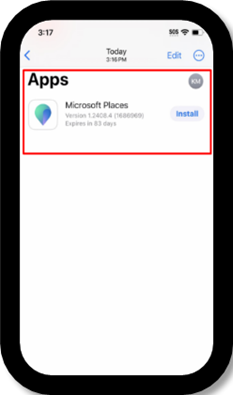
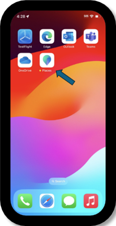

# Configure the iOS app for Microsoft Places

To enable the Microsoft Places mobile experience, an IT admin might need to configure the Mobile Application Management (MAM), and users must install Apple’s TestFlight app and the Places app on their mobile phones. This article explains how to install the Places app.

- These instructions are only in effect for the Private and Public Previews. Testing is managed through Apple’s TestFlight platform.

- TestFlight is an application and service owned by Apple. It's offered to app developers to make it easy to invite users to test apps and collect feedback before releasing their apps in the App Store.

- The Places mobile app can be made available to Private and Public Preview customers and their users who have iOS devices (version 16.4 or later).  

- Because the Places mobile app is still in its pilot phase and not yet available in the App Store, to allow Preview customers to install and test the application we've made the Places mobile iOS available (installed through Apple TestFlight).

## Prerequisites
> [!NOTE]
> The Microsoft Places iOS app is an opt-in feature. For more information, see [Opt in to the Microsoft Places Public Preview](opt-in-places-preview.md).

- Places is Deployed. For more information, see the [Deployment guide for Microsoft Places (preview)](deployment-guide-for-places.md).

- If applicable, your organization’s MAM policy should allow your users to download and install the Apple TestFlight app so they can install, run, and experience the Places iOS.

- If applicable, your organization’s MAM policy needs to be updated to allow employees to install the Places Mobile App (see guidance below).

## Enable Places mobile for your users

Run the following PowerShell cmdlet to enable the opt-in features for your tenant.

```powershell
Set-PlacesSettings -Collection Places -EnablePlacesMobileApp ‘Default:true' 
```

## The Places mobile app installation

To install the Places mobile experience (iOS only), an IT admin must update their Intune MAM policy (if applicable). Pilot users need to install the Places app on their mobile devices.

The mobile access installation process is made up of these four steps.

|Step  |Action     |Owner     |
|---------|---------|---------|
|**1**|Review and update mobile policies, if applicable (**see the appendix for further information**) |Customer IT admin or mobile-security admin  |
|**2**|URL is generated by the Places mobile team, which is shared with the customer using an email notification |Microsoft Places mobile team |
|**3**|Customer distributes the URL to their pilot users |Customer IT admin |
|**4**|The customer's pilot users click on the URL to download and install the Places iOS app |Pilot users |

> [!NOTE]
> It's a one-time process to install the Places app on your iOS device. Once the Places app is installed, users can open it from their mobile home screens.

### Steps for iOS Places app enablement and installation

#### Step 1: Review and update your mobile policies (IT admin)

- **See the appendix** for details and confirmation if your organization requires additional Unified Endpoint Management configuration.

#### Step: 2 The URL is generated and shared with the customer in an email notification (Places mobile team)

- [CHANGE COMING] The Places mobile team responds in e-mail to the customer within 24 to 48 hours and provides your organization’s URL for mobile installation (using Apple's TestFlight platform).

#### Step 3: The customer distributes the URL to their users (IT admin)

- The customer IT admin shares the URL with the iOS pilot users in their tenant.

   The following is a sample URL:

   

> [!NOTE]
> Users must be part of the Opt-in features and the EnablePlaceMobileApp should be set to **default:true** or be set to an SG for the desired users.

#### Step 4: The customer's users click on the URL to download and install the Places iOS app (pilot users)

1. Users navigate to the URL provided by their tenant admin in the browser of the user’s mobile device. **Note**: it's a **one-time** step to install the Places app.
2. The Apple TestFlight app installation directs users to a two-step process to install the Places app. **First**, install the Test Flight app. **Second**, return to the URL and tap on **Start Testing.** This launches the TestFlight app on the device and makes the user eligible to install the Places app.

   

3. In the TestFlight app, find the listing for **Microsoft Places** and tap **Install**.

   

4. Turn on the auto-updates feature to get access to new versions of the app on your mobile device (this is an **optional step**).

   

5. Open and sign in to the Places mobile app.

   Once the Places app is installed, it will show up in the user's dashboard like any other app installed from the App Store.

   You can tap to open the app and sign in using your corporate credentials (the same email that was granted access through PlacesEnabled and EnablePlacesMobileApp in the Places tenant settings.)

   

> [!NOTE]
> If you no longer want to test the app, you can also delete it yourself as a tester by visiting the app’s **Information** page in TestFlight and tapping **Stop Testing**.”

## MAM Intune configurations


